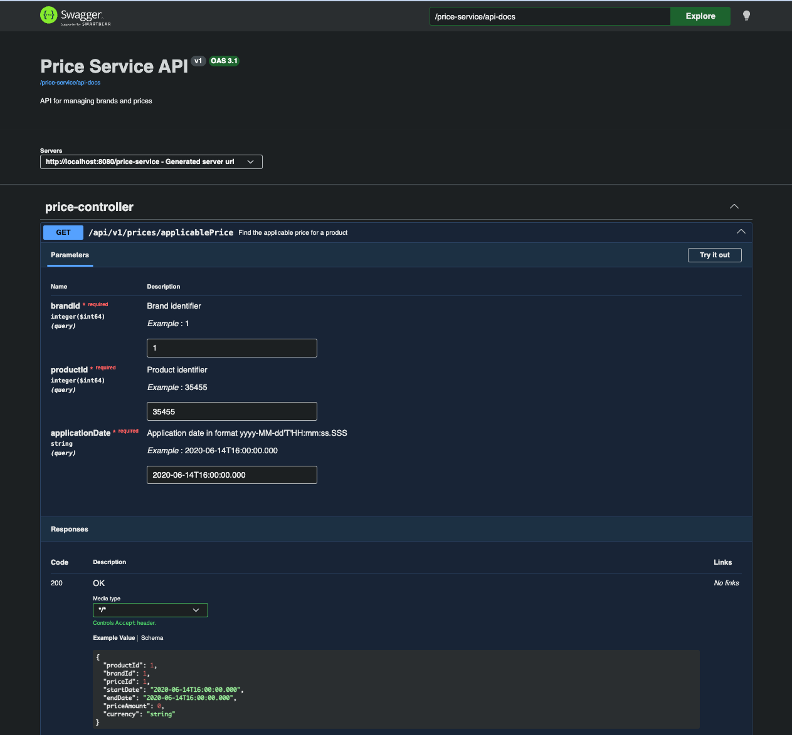

# Price Service API

A RESTFul web service built with **Spring Boot** and **Java 21**, designed using **Hexagonal Architecture (Ports and Adapters)**  principles.

The application provides an endpoint to query the applicable price for a given product, brand, and target date, resolving date-range overlaps based on priority field.



> Instructions at [InstructionsFile](Instructions.txt)

> Required Test File: [PriceControllerTest](src/test/java/com/qindel/test/prices/infrastructure/inbound/rest/PriceControllerTest.java) 
---

##  Prerequisites

* **Java 21** or higher.
* **Docker** (optional, for containerized execution).
* Local Maven installation is **not required**; the project includes the official Maven Wrapper (`./mvnw`).

---

## Running Tests

To execute the complete suite of unit and integration tests:

```bash
./mvnw clean test

```

## Running Locally

To launch the application using the Maven Wrapper:

```bash
./mvnw spring-boot:run

```

> Once started, the API will be available at http://localhost:8080/price-service/swagger-ui.html.
> > The health endpoint will be available at http://localhost:8080/price-service/actuator/health.
> 
> > The metrics endpoint will be available at http://localhost:8080/price-service/actuator/prometheus.

 ## Building and Running with Docker
1. Build the JAR file 

   Run the following command from the root directory (where the Dockerfile is located):
```bash
./mvnw clean package -DskipTests
```
2. Build the Docker Image

```bash
docker build -t price-service:1.0.0 .
```

3. Run the Container
```bash
docker run -d -p 8080:8080 --name price-service-app price-service:1.0.0
```


